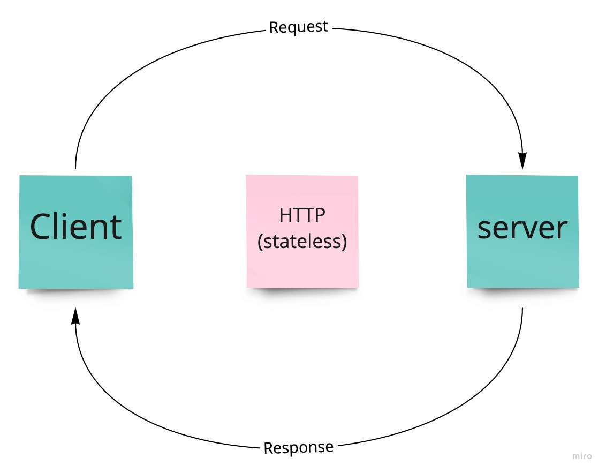

# basic-api-server

Author: Peter Staker

Deployed URL: [https://basic-api-server-ps.herokuapp.com/](https://basic-api-server-ps.herokuapp.com/)

## How to run locally

Fork or clone this repository

In your terminal, navigate into the new server-deployment-practice directory on your machine

Enter "npm i" in your terminal to install dependencies

Enter "npm start" in your terminal

## Web Request Response Cycle

